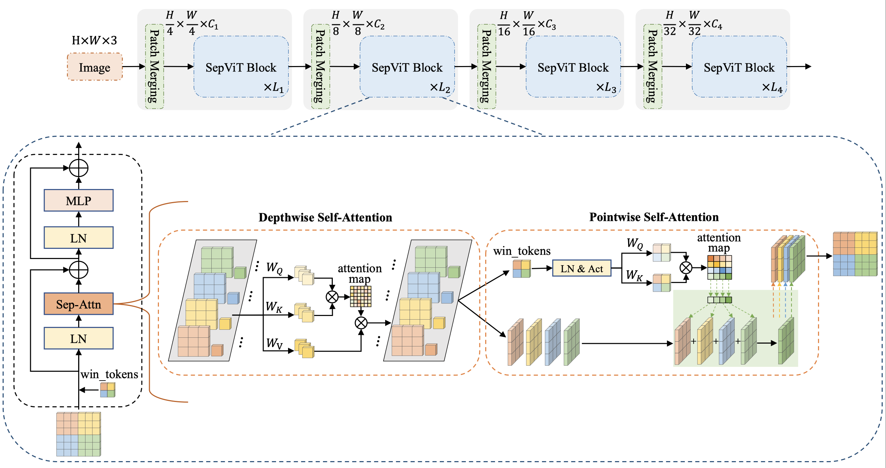

# SepViT: Separable Vision Transformers 
Vision Transformers have witnessed prevailing success in a series of vision tasks. However, these Transformers often rely on extensive computational costs to achieve high performance, which is burdensome to deploy on resource-constrained devices. To alleviate this issue, we draw lessons from depthwise separable convolution and imitate its ideology to design an efficient Transformer backbone, i.e., Separable Vision Transformer, abbreviated as SepViT. SepViT helps to carry out the local-global information interaction within and among the windows in sequential order via a depthwise separable self-attention. The novel window token embedding and grouped self-attention are employed to compute the attention relationship among windows with negligible cost and establish long-range visual interactions across multiple windows, respectively. Extensive experiments on general-purpose vision benchmarks demonstrate that SepViT can achieve a state-of-the-art trade-off between performance and latency. Among them, SepViT achieves 84.2% top-1 accuracy on ImageNet-1K classification while decreasing the latency by 40%, compared to the ones with similar accuracy (e.g., CSWin). Furthermore, SepViT achieves 51.0% mIoU on ADE20K semantic segmentation task, 47.9 AP on the RetinaNet-based COCO detection task, 49.4 box AP and 44.6 mask AP on Mask R-CNN-based COCO object detection and instance segmentation tasks.


This is a PyTorch implementation of SepViT specified in [Arxiv](https://arxiv.org/abs/2203.15380).

<!-- This code is based on the implementation of [Twins](https://github.com/Meituan-AutoML/Twins). -->


## Requirements
To run this code, please install:
```
torch==1.7.0, torchvision==0.8.1, timm==0.3.2
```
More requirements are listed in the requirements.txt.


## ImageNet-1K Classification
| Model  | Param (M) | FLOPs (G)  | Throughput (Img/s)| Latency (ms)| Top-1 (%) |
| :----: |:---------:|:----------:| :-------------------:|:-----------:|:---------:|
| SepViT-T      | 31.2 | 4.5 | 729 | 24.5 | 82.7 |
| SepViT-S      | 46.6 | 7.5 | 471 | 34.9 | 83.6 |
| SepViT-B      | 82.3 | 13.1| 302 | 46.6 | 84.2 |

### Training
To train SepViT-T on ImageNet using 8 gpus:
```python
python3 -m torch.distributed.launch --nproc_per_node=8 --use_env main.py --model SepViT_Tiny --batch-size 128 --data-path imagenet --dist-eval --drop-path 0.2
```

### Evaluation 
To evaluate the performance of SepViT-T on ImageNet:
```python
python3 main.py --eval --resume SepViT_Tiny.pth --model SepViT_Tiny --data-path imagenet
```


## ADE20K Semantic Segmentation
### Training
To train SepViT-T on Ade20K for 80k iterations:
```bash
 bash dist_train.sh configs/fpn_sepvit_t_512x512_80k_ade20k.py 8
```

#### Evaluation
To evaluate the mIoU of SepViT-T on Ade20K (single scale):
```bash
bash dist_test.sh configs/fpn_sepvit_t_512x512_80k_ade20k.py SepViT_T.pth 8 --eval mIoU
```

To evaluate the mIoU of SepViT-T on Ade20K (multi scale):
```bash
bash dist_test.sh configs/fpn_sepvit_t_512x512_80k_ade20k.py SepViT_T.pth 8 --eval mIoU --aug-test
```


## COCO Object Detection and Instance Segmentation
### Training
To train SepViT-T on COCO for 1x schedule (PVT setting) with the RetinaNet framework:
``` bash
 bash dist_train.sh configs/retinanet_sepvit_t_fpn_1x_coco_pvt_setting.py 8
```

To train SepViT-T on COCO for 3x schedule (Swin setting) with the Mask R-CNN framework:
```bash
 bash dist_train.sh configs/mask_rcnn_sepvit_t_fpn_3x_coco_swin_setting.py 8
```

#### Evaluation
To evaluate the mAP of SepViT-T on COCO under the framework of RetinaNet:
```bash
bash dist_test.sh configs/retinanet_sepvit_t_fpn_1x_coco_pvt_setting.py SepViT_T.pth 8 --eval mAP
```

To evaluate the mAP of SepViT-T on COCO under the framework Mask R-CNN:
```bash
bash dist_test.sh configs/mask_rcnn_sepvit_t_fpn_3x_coco_swin_setting.py SepViT_T.pth 8 --eval mAP
```


## Citation
If you find this project useful in your research, please consider cite:
```
@article{li2022sepvit,
  title={SepViT: Separable Vision Transformer},
  author={Li, Wei and Wang, Xing and Xia, Xin and Wu, Jie and Li, Jiashi and Xiao, Xuefeng and Zheng, Min and Wen, Shiping},
  journal={arXiv preprint arXiv:2203.15380},
  year={2022}
}
```

